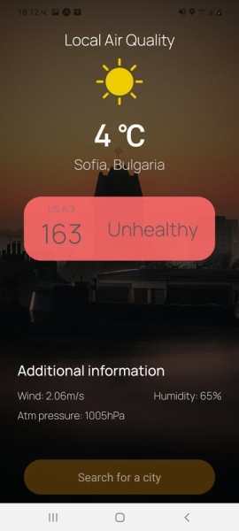

# Air-Pollution-App-React-Native
An application that shows the current weather and air pollution statistics.

Need Expo to run this app.

# Installation
Clone the repo
*  ``` git clone https://github.com/juliepetrova/Air-Pollution-App-React-Native.git ```

Install Dependencies
 * ``` yarn ```   or use npm    ``` npm install ```

Make sure that you have install expo globally.

* ``` npm i -g exp ```

Lunch the app
* ``` exp start --offline ```

You can run it on ios devices
* ``` exp r --tunnel ```

> Make sure android sdk is configure
> properly if you are running this
> application on AVD (android virtual devices.)

# Description

A simple react-native application, that uses Air Visual API for delivering accurate data. This application was build for learning purpose

|   |   |   |
